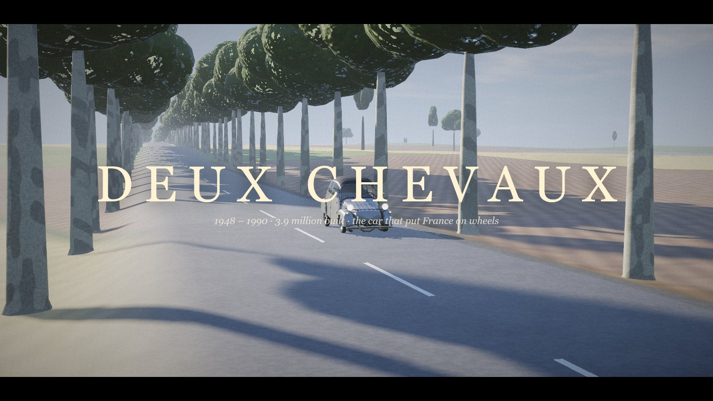
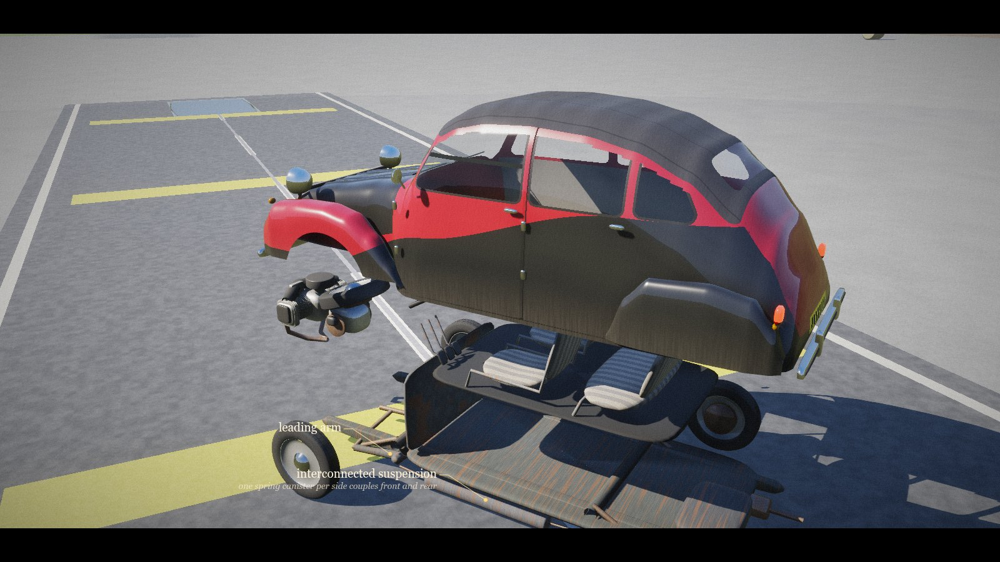
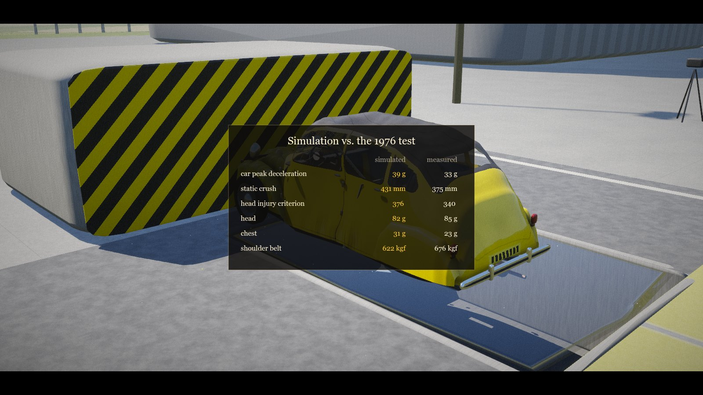
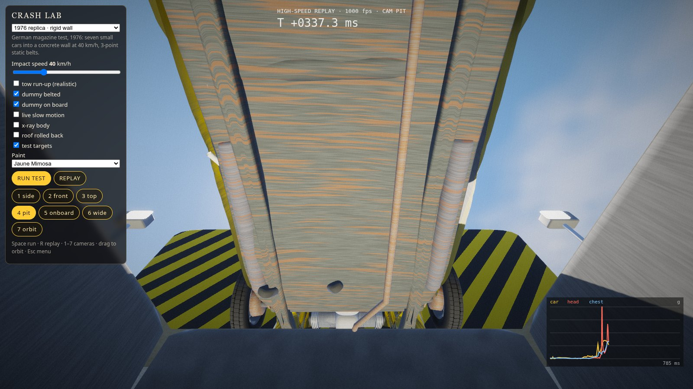
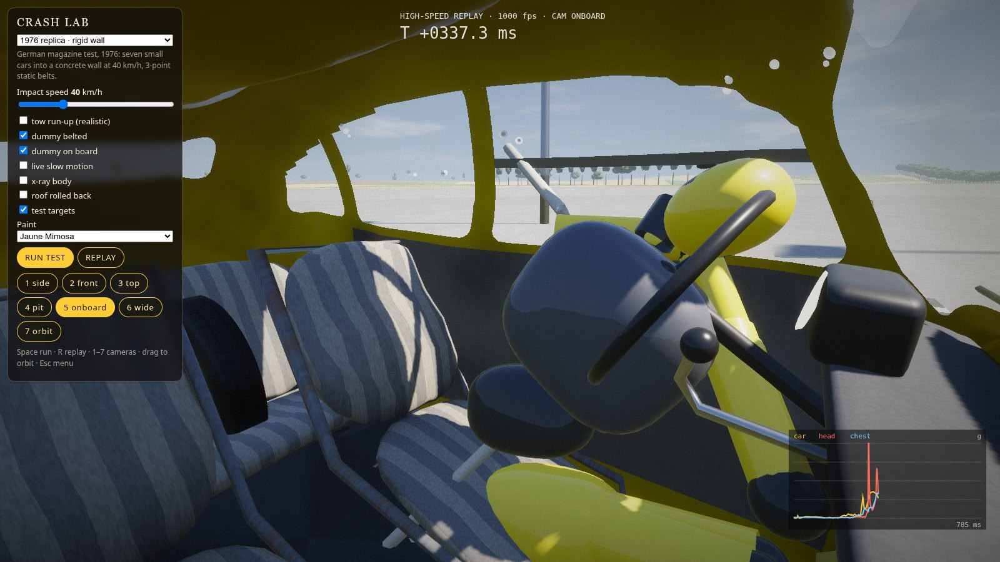

# DEUX CHEVAUX

A Citroën 2CV crash test — film, crash lab and open world — in one self-extracting **53 KiB** WebGL2 page.
No images, models, samples or libraries: the car, the dummy, the French countryside, the sound and the story are
generated by code at load time.

```
./run.sh            # builds (if node is present) and serves on http://0.0.0.0:9070/
PORT=8000 ./run.sh  # another port;  NO_BUILD=1 ./run.sh serves the last dist/
```
`dist/index.html` is the packed page, `dist/dev.html` the readable build of the same code.



## What's in it

**The car.** A 2CV6 built from parametric surfaces to the real dimensions (3830 × 1480 × 1600 mm, 2400 mm wheelbase,
1260 mm track, 125 R 15 tyres): the ribbed bonnet, bolt-on wings and rear spats, round headlamps on their bar,
four front-hinged doors and the six-light glasshouse, flap-up front windows, roll-back canvas roof, chevrons and
grille. Underneath: the platform chassis, leading and trailing arms, the interconnected spring canisters, the
602 cm³ air-cooled flat twin with finned barrels and its cooling fan, gearbox with inboard disc brakes, driveshafts,
exhaust and silencer, fuel tank, the spare wheel under the bonnet. Inside: tubular seats, the umbrella-handle gear
lever coming out of the dashboard, single-spoke wheel, pedals. Seven period paints, including the Charleston.



**The physics.** Two models of the same car:
- *Driving* — a rigid body on the 2CV's interconnected suspension (front and rear spring on each side share one
  canister: stiff in heave, very soft in pitch), slip-angle tyres, the 39 N·m flat twin with a 4-speed box,
  Cd 0.51 drag: 0–100 km/h in ~30 s and ≈ 110 km/h flat out (the real 2CV6: ~32 s, 115 km/h).
- *Crashing* — the moment it touches something, the car becomes a 948-node / 7,900-beam soft-body lattice
  (BeamNG-style) built from the same section functions as the mesh: shell, platform and side members, engine
  block, bulkhead, dash rail, glass (brittle), canvas (tension only), wheel hubs on hinged arms. Beams are
  force-limited: past their yield force they flow plastically, compression yields before tension, folded metal
  densifies, stretched metal tears. Small-step XPBD at 1,020 Hz. When the car comes to rest the deformed shape
  becomes its new rigid shape, so crashes accumulate. The mesh follows the lattice on the GPU (each vertex rides
  4 nodes and their local rotations), and plastic strain drives creased, paint-flaked metal in the shader.
- *The dummy* — a 78 kg Hybrid-III-like occupant as 17 particles, a 3-point static belt modelled as two pulley
  paths anchored on the B-pillar, sill and tunnel, hands on the wheel until the load tears them off. HIC15, 3 ms
  head and chest acceleration and belt load are measured the way a lab measures them.

**Calibration.** A German magazine crash-tested a 2CV in 1976: rigid wall, 40 km/h, static belts. The lattice
strength was set against that test, and the lab re-runs it live:

| 1976, 40 km/h | measured | simulated |
|---|---|---|
| car peak deceleration | 33 g | 39 g |
| static crush | 375 mm | 431 mm |
| HIC15 | 340 | 376 |
| head (3 ms) | 85 g | 82 g |
| chest (3 ms) | 23 g | 31 g |
| shoulder-belt load | 676 kgf | 622 kgf |

Like the real car, the front folds and the cabin barely deforms. The chest reading stays high; the gap is shown
in the app rather than tuned away.



**The crash lab.** Seven tests at any speed from 10 to 120 km/h: the 1976 replica, full-width wall (FMVSS 208),
Euro NCAP 40 % offset deformable barrier (crushable honeycomb), side pole, a roadside plane tree, 2CV vs 2CV
head-on, and a corkscrew-ramp rollover. Tow-cable run-up, belted / unbelted / no dummy, x-ray body, roof open,
test targets, paint. Each run is recorded at 500 Hz and replayed in slow motion from seven cameras, including the
under-floor camera pit and an onboard view of the dummy, with live car / head / chest curves and a report card.

 

**The open road.** Drive the 2CV down an avenue of plane trees, across the ploughed field, around the test centre.
Everything solid can be hit; `P` replays your last crash in slow motion, `F` fixes the car.

**The film** (≈ 2½ min): the avenue at dawn, the 1936 brief and the ploughed field in x-ray, an exploded anatomy
of the 2CV6, the 1976 test re-run with four slow-motion angles, simulation vs. measurement, and today's 64 km/h
offset test.

## Controls
- Film: ← → shots · Space pause · M mute · Esc menu
- Lab: Space run · R replay · Enter next replay angle · 1–7 cameras · drag / wheel to orbit · Esc menu
- Drive: W/↑ throttle · S/↓ brake, hold to reverse · A D steer · Space handbrake · C camera · F fix · P replay · T time of day

## Code
| file | |
|---|---|
| `src/car.js` | the 2CV geometry: body loft from cross-sections, wings, glasshouse/seam/canvas fields, running gear, engine, interior |
| `src/lattice.js` | the structural lattice, materials, calibration constant, vertex → node skin binding |
| `src/soft.js` | node/beam XPBD world: plastic beams, belt pulleys, colliders incl. crushable honeycomb, node rotations |
| `src/vehicle.js` | rigid driving model, rigid ↔ soft hand-over, bones |
| `src/dummy.js` | the dummy, belt, injury criteria, dummy mesh |
| `src/sim.js` | tests, stepping, 500 Hz recorder, replay, report |
| `src/render.js`, `src/glsl.js` | WebGL2 renderer: PBR + sky reflections, shadow cascades, MSAA HDR, DOF, bloom, grade |
| `src/story.js`, `src/main.js` | the film; modes, cameras, HUD |
| `test/calib.mjs`, `test/calib2.mjs`, `test/tests.mjs` | headless calibration and every test, in Node |
| `test/view.mjs`, `test/fps.mjs` | real-GPU screenshots and frame rate |

Research sources: Wikipedia's 2CV article (dimensions, suspension, engine, brief), citroenet.org.uk (2CV6 data),
automobile-catalog.com (2CV6 Spécial torque and dimensions), cats-citroen.com (the 1976 crash test figures).
